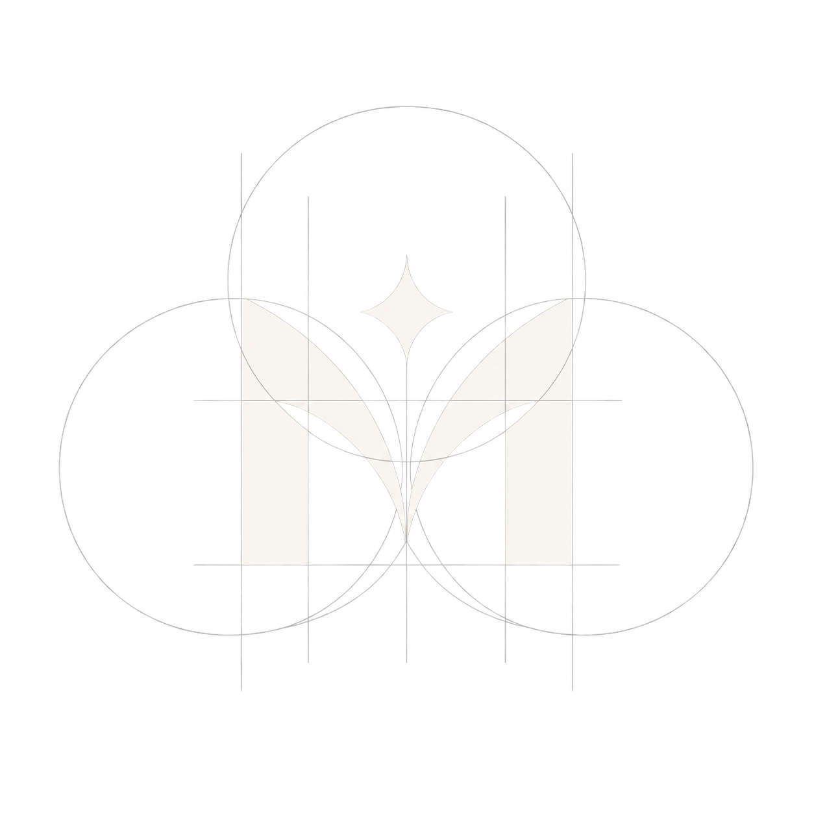

# MOVA — Don't Follow People. Follow Moments.

<div align="center">
  
  <br />
  <p><strong>A spontaneous, real-time spatial social application for campus and community moments.</strong></p>
  <p><em>No infinite follower feeds. No vanity metrics. Just real people arriving together right now.</em></p>
</div>

---

## 🌟 Philosophy & Vision

Traditional social networks reward influencers, audience accumulation, and curated retrospective perfection. **MOVA** flips the model on its head:

- **Moments over Profiles**: You don't follow users; you jump into spontaneous, ephemeral situations happening within walking distance.
- **Physical Proximity & Real Time**: Moments have walking distances, real-time countdowns, and campus landmark anchors.
- **Synchronous Community Drops**: Campus-wide 5-minute prompts where everyone drops their perspective simultaneously before the moment closes forever.
- **Tactile Digital Analog**: A warm, paper-toned aesthetic combining rich hand-drawn crayon accents, tactile spring physics, polaroid scrapbook memories, and custom synthesized acoustic feedback.

---

## 🚀 Tech Stack & Engineering Architecture

| Layer | Technology | Purpose |
| :--- | :--- | :--- |
| **Core Framework** | **React 18** | Functional component architecture, hooks, memoized selectors |
| **Language** | **TypeScript 5** | Strict end-to-end type safety across domain models and interfaces |
| **Build & Tooling** | **Vite 6** | Ultra-fast HMR and optimized Rollup code-splitting |
| **Styling** | **Tailwind CSS 3** | Utility-first styling with custom semantic design system tokens |
| **Spatial Engine** | **Leaflet + CartoDB** | High-performance interactive campus tile map with custom radar markers |
| **Motion & Physics** | **Framer Motion** | Spring physics, velocity handoff, gesture-driven drag and swipe decks |
| **Design Engineering** | **Emil Kowalski Craft** | `:active` tactile button scaling, custom `cubic-bezier(0.23, 1, 0.32, 1)` easings, spacious optical layout |
| **Audio Synthesizer** | **Web Audio API** | Zero-latency algorithmic tone synthesis for clicks, joins, passes, and alerts |
| **Typography** | **Plus Jakarta Sans**, **Kalam**, **Space Mono** | Clean UI typography, authentic crayon accents, and tabular numerical timers |
| **Icons** | **3D Rendered Assets** + **Lucide React** | Tactile 3D skeuomorphic iconography combined with crisp SVG symbols |
| **Testing** | **Vitest + JSDOM** | Unit, integration, security sanitization, and keyboard navigation tests |

---

## ✨ Key Features

### 1. 🗺️ Campus Live World & Spatial Radar
- **Interactive Map**: Built on CartoDB Positron tiles, featuring live campus landmarks (Central Quad, Library Steps, Arts Studio, Canteen Verandah, Sports Complex).
- **Landmark Teleportation**: Quick-jump HUD controls to fly directly to campus hotspots.
- **Proximity & Walking Times**: Computes distance in meters and walking minutes directly on moment pins.
- **Live User Pulse**: Pulsing animated radar marker indicating user location.

### 2. 🎴 Physical Swipe Deck
- **Gesture-Driven Decisions**: Fluid drag-and-throw card stack powered by Framer Motion spring physics.
- **Velocity-Aware Momentum**: Flick cards left to **Pass** or right to **Join** with real momentum projection.
- **Thread Access**: Inspect living threads directly from the active card.

### 3. 🍱 Tactile Bento Grid View
- **Spacious & Breathable**: Generous margins, clean negative space, and uncrowded 2-column cards.
- **Visual Status Badges**: Live participant avatars, remaining countdown timers, and synchronized drop tags.

### 4. ⚡ 8 Canonical Real-Time Vibe Situations
Filter the campus situation instantly without typing:
1. ☕ **Chai & Talks** — Casual porch conversations and warm tea runs.
2. 🏸 **Badminton** — Active sports courts needing an extra player.
3. 🎸 **Late Jam** — Acoustic jamming, instruments, and music sessions.
4. 📚 **Silent Library** — Focused deep-work study sprints.
5. 🌅 **Rooftop Chill** — Golden hour sunsets and relaxed hangouts.
6. 🍕 **Quick Bite** — Spontaneous canteen snacks and food cravings.
7. 💻 **Hack & Code** — Fast pairing and collaborative software builds.
8. ⚡ **Spontaneous** — Whatever unfolds in the next 10 seconds.

### 5. ⏱️ 5-Minute Synchronized Community Drops
- **Global Synchronized Triggers**: At scheduled times, the entire campus receives the exact same prompt (e.g. *"Show what's on your desk right now"*).
- **5-Minute Countdown**: Urgency-driven participation window that closes forever when time expires.
- **Live Multi-Angle Wall**: Real-time mosaic of perspectives from peers across campus.

### 6. 📸 Memories Scrapbook Archive
- **Analog Polaroid Styling**: Genuine polaroid-framed memories with handwritten labels and timestamp stamps.
- **Permanent Digital Keepsakes**: When active moments conclude, their shared artifacts automatically archive into the community memory bank.

### 7. 💬 Living Moments & Arrival Confirmation
- **Multi-Modal Contributions**: Add photos, draw canvas sketches with custom ink strokes, or record simulated voice notes upon joining.
- **Living Discussion Threads**: Branch conversations and collaborative perspectives attached to each moment.

### 8. 🔊 Synthesized Web Audio Feedback
Custom Web Audio API synthesizer providing immediate acoustic delight:
- **Click**: Crisp high-frequency tactile tick (800Hz → 1200Hz).
- **Join**: Euphoric ascending dual chime (523.25Hz → 659.25Hz → 783.99Hz).
- **Pass**: Gentle low-frequency swoosh (350Hz → 180Hz).
- **Drop Alert**: Attention-grabbing synthesized chime for urgent drops.
- **Mute Toggle**: Global toggle with persistent user preference.

### 9. ♿ Accessibility & Universal Navigation
- **Keyboard Shortcuts**: Navigate effortlessly without a mouse:
  - `→` / `L` : Join Moment
  - `←` / `H` : Pass Moment
  - `Esc` : Close open drawers and modals
  - `?` : Toggle keyboard shortcuts helper
- **WCAG 2.1 AA Compliance**: High-contrast ratios verified across all surfaces.
- **Live Screen Reader Announcer**: Centralized `aria-live` region announces all actions in real-time.
- **Focus Traps**: Robust tab-key trapping inside modals and confirmation drawers.

---

## 🎨 Design System & Color Palette

Rooted in the official MOVA Design Specification:

```css
:root {
  --mova-canvas:       #FFFFFF;                  /* Crisp white canvas */
  --mova-maroon:       #8B1E3F;                  /* Primary brand & hero CTAs */
  --mova-rose:         #C9A0A0;                  /* Soft surface accent & light badge */
  --mova-gold:         #D4AF37;                  /* Activity gold, urgent drops & timers */
  --mova-ivory:        #F5E6D3;                  /* Warm tactile neutral surface */
  --mova-nearblack:    #2B2024;                  /* High-contrast primary typography */
  --mova-border:       rgba(43, 32, 36, 0.08);   /* Subtle, airy semi-transparent borders */
}
```

---

## 📁 Directory Structure

```
MOVA/
├── public/                  # Static web assets
├── src/
│   ├── assets/              # Brand logo & graphics (MOVALOGO.png)
│   ├── components/
│   │   ├── common/          # Button, Icon3D, LiveAnnouncer
│   │   ├── drawer/          # ConfirmationDrawer (gesture sheet + sketch pad)
│   │   ├── drops/           # DropCard, DropModal (synchronized community drops)
│   │   ├── memories/        # MemoryCard, MemoryModal (polaroid scrapbook)
│   │   ├── moments/         # MomentCard, SwipeStack (gesture decision deck)
│   │   ├── navigation/      # TopNav (spacious header, segmented tabs, sound toggle)
│   │   ├── thread/          # LivingThreadModal (multi-perspective branches)
│   │   ├── vibe/            # VibeSelector, SparkModal (situation filter & creator)
│   │   └── world/           # LiveWorld, RealisticMap (interactive Leaflet map)
│   ├── data/                # Mock domain datasets (moments, drops, vibes, threads)
│   ├── hooks/               # useClock, useAudioFeedback, useKeyboardNav, useFocusTrap
│   ├── lib/                 # utils, validation, security, 3d-icons mapping
│   ├── styles/              # tokens.css, globals.css (Tailwind layers & easings)
│   ├── types/               # TypeScript domain type definitions (mova.d.ts)
│   └── App.tsx              # Main application shell & root state coordinator
├── tests/                   # Automated Vitest test suite
├── package.json             # Dependencies and npm scripts
├── tailwind.config.js       # Design tokens & transition easings
├── tsconfig.json            # Strict TypeScript configuration
└── vite.config.ts           # Optimized Rollup chunks & build settings
```

---

## 🛠️ Getting Started

### Prerequisites
- **Node.js**: v18.0.0 or higher
- **npm**: v9.0.0 or higher

### Installation

1. Clone the repository:
   ```bash
   git clone https://github.com/tnex0734-ops/MOVA.git
   cd MOVA
   ```

2. Install dependencies:
   ```bash
   npm install
   ```

3. Launch the development server:
   ```bash
   npm run dev
   ```
   Open your browser to **`http://localhost:5173/`**.

### Production Build & Optimization

To compile and bundle for production:
```bash
npm run build
```
Preview the production build locally:
```bash
npm run preview
```

### Running Automated Tests

Run the test suite with Vitest:
```bash
npm test -- --run
```

---

## 📜 License

Created for MOVA. All rights reserved.
